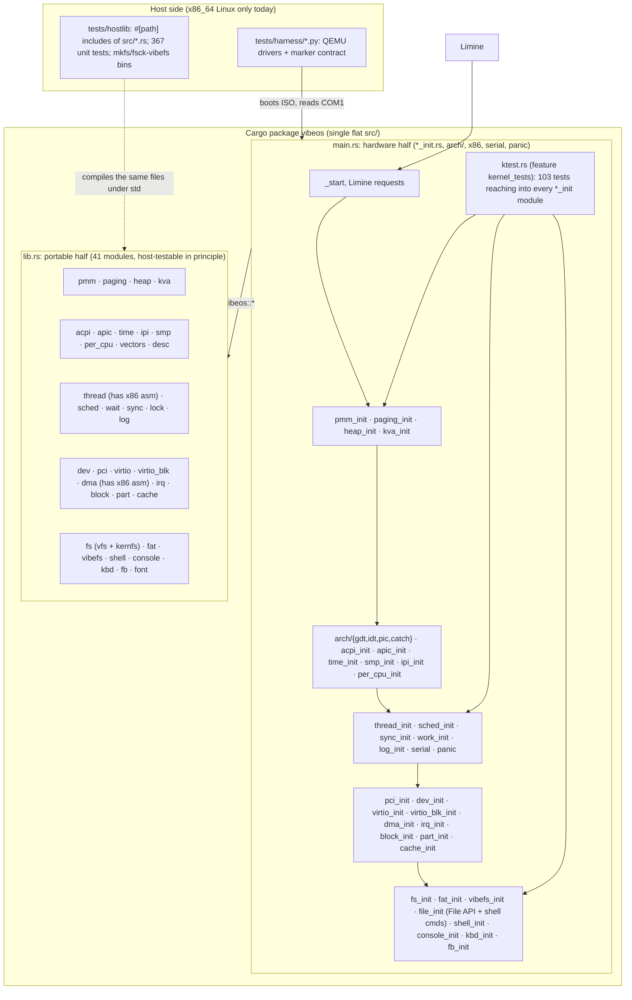

# vibeOS Architecture Review

**Date:** 2026-09-22 · **HEAD reviewed:** `dd04ac9` (Fix QEMU window PS/2 keyboard, #67) · **Mode:** read-only, evidence-based

**Per-issue implementation plans:** [issues/README.md](issues/README.md) (one document per recommendation).

**Revision 2 (2026-09-22):** maintainer answers to §8 folded in (macOS is a supported dev host, MIT license, Phase 9 resumed, custom target was not a deliberate choice, CI takes a few minutes). E1 corrected after a non-test-only recount; see §9.3.

Effort scale used below: **S** ≤ 1 day, **M** a few days, **L** 1–2 weeks, **XL** longer. Impact is relative to the project's stated goal (a testable, agent-written kernel that keeps advancing through the roadmap).

---

## 1. Executive Summary

**What it is.** vibeOS is a monolithic x86_64 kernel in Rust whose code is written by AI coding agents (README: "no human writes code here"). It boots via Limine into a higher-half kernel and, as of Phase 8, has its own page tables, buddy PMM, heap, KVA allocator, GDT/IDT, ACPI, PIT/HPET/TSC timekeeping, LAPIC/IOAPIC, a preemptive per-CPU scheduler with SMP bring-up and TLB shootdown, a kernel log ring, framebuffer/PS-2/serial console, an in-kernel shell, PCI + MSI-X + DMA + virtio (rng, blk), a block layer with partitions and a write-back cache, a VFS, FAT32 read/write, kernfs-based pseudo filesystems, and a home-grown CoW filesystem (vibefs) with host `mkfs`/`fsck`. About 46k lines of Rust in one Cargo package, ~40 commits, phases 0–8 landed between 2026-09-16 and 2026-09-19. Phase 9 (user mode) is next; a pause caused by usage limits was lifted on 2026-09-22.

**Overall health: strong discipline, structural drift starting to compound.** The testing and documentation culture is unusually good: three test tiers (367 host unit tests, 103 in-guest tests, a serial-marker e2e contract with 37 harness self-tests), an explicit lock-rank system, a documented panic policy with symbolized backtraces, and a 53-entry "pitfalls" ledger. The weaknesses are not in any subsystem's logic; they are in the scaffolding around it, which was laid down in Phase 0 and never revisited while the tree grew 10×: a flat 84-file `src/` that contradicts the documented module map, a "host-testable" half that only compiles on x86_64 Linux, a VFS that real filesystems bypass, test hooks threaded through 27 production modules, five copy-pasted ISO recipes, and quality gates (fmt, clippy, `-Dwarnings`) that the roadmap deferred at Phase 0 and never landed. None of this is urgent today. All of it gets more expensive once Phase 9 adds processes, syscalls, and a second address space.

**Top recommendations.**

1. **Make the portable half actually portable and land the promised gates (A2, Q1, C1).** `src/thread.rs` and `src/dma.rs` contain x86 inline assembly, so `tests/hostlib` pins `x86_64-unknown-linux-gnu`; `make test-unit` fails outright on the maintainer's macOS/Apple Silicon machine, which is a supported dev host (confirmed 2026-09-22; it is where the kernel gets booted by hand and bugs get reported). At the same time, 65 of 84 Rust files fail `rustfmt --check`, no `-Dwarnings`/clippy gate exists, and the nightly toolchain is undated. These are small fixes that unblock every other item and make agent output checkable.

2. **Put the VFS in charge before Phase 9 (A3, D1).** `FatFs` and `VibeFs` in `src/fs/mod.rs` only implement `fill_super`; all real file I/O goes through a `Back::{Fat, Vibe}` enum in `src/file_init.rs` that re-dispatches by hand. Processes and fd tables will need a single `InodeOps` path over every mount. Do this alongside a plan for the 53 fixed-capacity `MAX_*` tables (`MAX_THREADS = 64`, `MAX_FILES = 16`, `MAX_FDS = 16`, `MAX_INODES = 48`), which are fine for a kernel shell and a wall for processes.

3. **Restructure `src/` to match a corrected module map and isolate test scaffolding (A1, Q2, T1).** The `foo.rs`/`foo_init.rs` pairing is a good idea expressed as 84 siblings in one directory. Move to one directory per subsystem, split the 4,083-line `src/ktest.rs` into per-subsystem test modules, and stop compiling `kernel_tests`-only accessors into production modules.

4. **Collapse build and harness duplication (B1, B2, T2, P1).** The Makefile carries five near-identical ISO recipes and five two-pass builds across five target directories. Three Python drivers each construct their own QEMU command line and panic-signature list. A parametrized recipe, a single QEMU launcher, and the built-in `x86_64-unknown-none` target (B2) cut build time and remove the "hostlib inherits a second `core`" hack. (CI wall time is already only a few minutes, so this is about simplicity and local iteration.)

5. **Fix the top of the documentation funnel and version the agent instructions (DOC1, DOC3).** `README.md` still says "Phase 0 is mostly landed"; `docs/DESIGN.md` opens with "almost nothing described here exists as code yet"; the DESIGN §1.3 module map describes a layout that does not exist; the only agent rules file (`.cursor/rules/general.mdc`) is gitignored, references files that do not exist, and there is no `CLAUDE.md`/`AGENTS.md` or `LICENSE` (the maintainer has chosen MIT). For a project whose premise is that agents read the docs and write the code, these are the first things every session sees.

---

## 2. Project Overview (as-is)

### 2.1 Purpose

A x86_64 kernel used to measure how far coding agents get on low-level systems work while keeping the tree buildable and tested (`README.md`). The roadmap (`docs/ROADMAP.md`) runs 21 phases from boot to self-hosting; the design document (`docs/DESIGN.md`) fixes invariants (lock order, address map, vector map, boot order, panic policy) so agents cannot re-litigate them mid-implementation.

### 2.2 Tech stack

| Concern | Choice | Evidence |
|---|---|---|
| Language | Rust nightly, edition 2024, `no_std` + `alloc` | `Cargo.toml`, `rust-toolchain.toml` (`channel = "nightly"`, undated) |
| Target | Built-in `x86_64-unknown-none` + rustflags (B2 replaced a custom JSON + `build-std`) | `Makefile`, `.cargo/config.toml` |
| Boot | Limine v9.6.7 (binary branch cloned by `setup.sh`), hybrid BIOS+UEFI ISO via xorriso | `setup.sh`, `Makefile`, `limine.conf` |
| Link | `linker.ld`, higher-half at `0xFFFF_FFFF_8000_0000`, per-section PHDRs for W^X | `linker.ld` |
| Dependencies | One crate: `limine 0.6.5` | `Cargo.lock` |
| Build glue | `build.rs` (nasm trampoline, ksyms include, FAT initrd), `scripts/gen_ksyms.py`, `scripts/mkinitrd.py` | `build.rs`, `scripts/` |
| Tests | Rust host tests via `tests/hostlib` (`#[path]` includes), in-guest `ktest` feature build, Python QEMU harness | `tests/`, `src/ktest.rs` |
| CI | GitHub Actions, one Ubuntu job running the whole ladder; weekly SMP stress | `.github/workflows/ci.yml`, `smp-stress.yml` |
| Agent env | `.cursor/environment.json` (tracked), `.cursor/rules/general.mdc` (ignored) | `.gitignore:160` |

### 2.3 Component map

The package has two crate roots over one `src/` directory:

- **`src/lib.rs` — the "portable half" (41 modules).** Parsers, allocators, encodings, state machines. Every module here also has a `#[test]` block (367 tests total). Compiled a second time on the host by `tests/hostlib/src/lib.rs`, which re-includes each file with `#[path = "../../../src/x.rs"]`.
- **`src/main.rs` — the "hardware half".** `_start`, Limine requests, and a `*_init.rs` sibling for almost every lib module (`pmm.rs`/`pmm_init.rs`, `fat.rs`/`fat_init.rs`, …) plus `arch/{gdt,idt,pic,catch}.rs`, `x86.rs`, `serial.rs`, `panic.rs`, `diag.rs`, and `ktest.rs` (feature-gated).
- **Boot sequence** (`src/main.rs:normal_boot_tail`): serial → Limine → PMM → paging → ACPI+UC → heap → KVA → GDT/PIC/IDT → per-CPU → time → LAPIC/IOAPIC → scheduler → SMP → console → PCI → workqueue → virtio → devfs registry → block → cache → partitions → VFS/FAT/kernfs/vibefs → shell.
- **Test tiers** (`docs/DESIGN.md §8`): host unit (`make test-unit`), in-guest (`make test-kernel*`, `isa-debug-exit`), e2e marker contract (`make test-e2e*`), plus panic, #GP, PIT-fallback, UEFI, PS/2, and vibefs crash-consistency variants.

Size and shape at a glance:

| Metric | Value |
|---|---|
| Rust source lines (`src/`) | 46,064 (incl. `ktest.rs` 4,083) |
| Rust files in `src/` | 84 (+ `trampoline.asm`) |
| Largest files | `ktest.rs` 4,083 · `fs/mod.rs` 2,873 · `vibefs.rs` 2,549 · `fat.rs` 2,387 · `fs/kernfs.rs` 1,704 · `file_init.rs` 1,516 |
| Host `#[test]` / in-guest tests / harness tests | 367 / 103 / 37 |
| `unsafe` occurrences · `unsafe fn` · `# Safety` sections | 734 · 90 · 50 |
| `static mut` · hand-rolled `UnsafeCell + unsafe impl Sync` wrappers | 13 · 17 (in 17 files) |
| `MAX_*` fixed-capacity constants | 53 |
| ROADMAP checkboxes done / open | 411 / 610 |
| Files failing `rustfmt --check` | 65 of 84 |

### 2.4 Current architecture

---

## 3. Strengths to Preserve

These are working and should survive any restructuring untouched in spirit.

- **The lib/bin split as a testing lever.** Every algorithmic module (buddy, page walk, ACPI/PCI/FAT/GPT/vibefs parsers, seqlock math, scan-code decoder, tokenizer, ring buffers) is host-tested; 41 of 41 lib modules have a `#[cfg(test)]` block. This is the single biggest reason the tree is checkable (`docs/DESIGN.md §1.1` item 2).
- **The serial marker contract and its harness.** `src/marker.rs` strings are asserted in order by `tests/harness/harness.py`, which fails fast on exception mnemonics (not English prose), quits QEMU on the last marker, and has 37 unit tests of its own (`test_harness.py`). Keep the rule that a marker and its harness entry land in the same commit.
- **Lock discipline made concrete.** `src/lock.rs` encodes the DESIGN §2.1 ranks as testable bit math; `src/sync_init.rs` has exactly one spinlock type and it is IRQ-aware. The "Design ACK" convention for documented deviations (FS locks at device rank) is a good pattern.
- **Panic path.** `src/panic.rs` follows the documented binding order (halt IPI → serial re-init → regs/thread/log tail → symbolized backtrace → halt or `isa-debug-exit`), with a two-pass `nm` symbol table (`scripts/gen_ksyms.py`) so `.text` does not move. Expected-panic and #GP e2e variants verify the dump content.
- **Test builds cannot leak into production.** Each feature build (`panic-test`, `gp-test`, `kernel_tests`, `vibefs_crash`) uses its own `CARGO_TARGET_DIR` and ISO (`Makefile`, DESIGN §8.2).
- **vibefs engineering.** Format documented before code (`docs/VIBEFS.md` with a version field), kernel and host `mkfs`/`fsck` share `src/vibefs.rs`, a host `CrashDisk` drops writes mid-commit, and `tests/harness/run_vibefs_crash.py` SIGKILLs QEMU at random points and requires a clean `fsck`.
- **Institutional memory.** `docs/DESIGN.md §9` records 53 symptom-first pitfalls, each naming the rule that guards it. The `_start` order table (§3.3) and address map (§4.1) are load-bearing and cited from module headers.
- **Dependency footprint.** One crate (`limine`), lockfiles committed, standard-library-only Python. Nothing to audit.
- **Every module has a `//!` header** naming its responsibility and the DESIGN/ROADMAP section it implements. This is worth more than any generated API doc.
- **Bounded polling everywhere** (`TX_POLL_CAP` in `src/serial.rs`, ICR poll caps, AP bring-up timeouts), and `CHANGELOG.md` discipline from the first commit.

---

## 4. Findings & Recommendations by Area

### 4.1 Architecture & module boundaries

**A1 · Reshape `src/` into one directory per subsystem, matching a corrected module map**
- **Observation:** `src/` holds 84 Rust files side by side, most as `foo.rs` (portable) / `foo_init.rs` (hardware) pairs, plus a nearly empty `src/arch/` (4 files) and `src/fs/` (2 files). `docs/DESIGN.md §1.3` describes a different, nested layout (`src/mm/pmm/`, `src/arch/x86_64/`, `src/interrupts/`, `src/drivers/`, …) and labels it "target layout"; none of it exists. `src/x86.rs:1` says "real CPU state work lives under `src/arch/` in later phases" while itself holding CR3/MSR/CPUID/GDT-load primitives. `src/file_init.rs` (1,516 lines) mixes the kernel File API, twelve shell commands, and tab completion.
- **Chronology and decision:** the DESIGN map came first (commit `4e51646`, 2026-08-01); the flat `_init` pairing arrived with the first code (`1db35eb`/`d4d0b6f`, 2026-09-16/17). The maintainer leans toward the later convention and otherwise defers to this review.
- **Recommendation:** Keep the lib/bin pairing (the newer, working convention) and nest it per subsystem: express it as `src/<subsystem>/{mod.rs, kernel.rs}` (or `core.rs`/`init.rs`) so each subsystem is one directory with its portable and hardware halves adjacent, and rewrite DESIGN §1.3 to describe that. Move shell builtins out of subsystem modules into `src/shell/cmds/*.rs`. Do this after Q1 (formatting) so the move is a pure move.
- **Impact:** High · **Effort:** L · **Risk if ignored:** Every phase adds 4–8 more siblings; agents keep discovering structure by `ls` and the doc keeps lying.

**A2 · Make the "portable half" portable: no arch asm in `lib`, host tests on any host**
- **Observation:** `src/thread.rs` (context-switch `global_asm!`, `#[cfg(target_arch = "x86_64")]` at line 211) and `src/dma.rs` (fence `asm!` at lines 180/193) live in the lib half. Because of that, `tests/hostlib/.cargo/config.toml` pins `target = "x86_64-unknown-linux-gnu"`, and `Makefile:HOST_TRIPLE` hard-codes the same. On the maintainer's machine (macOS, aarch64; confirmed on 2026-09-22 as a supported dev host that must be able to run the checks) `make test-unit` fails with "the `x86_64-unknown-linux-gnu` target may not be installed". `tests/hostlib/src/lib.rs` also re-lists all 41 modules by hand; any mismatch with `src/lib.rs` is silent.
- **Recommendation:** Move `switch_context` and the DMA fences to the hardware half (or behind a `cfg(target_arch)`-gated `arch` submodule with a no-op host fallback), drop the Linux target pin, and turn the hostlib into a normal workspace member that depends on the portable crate rather than re-including files by path (see B2 for the `build-std` obstacle). Add a macOS host-test job once it passes (I1).
- **Impact:** High · **Effort:** M · **Risk if ignored:** The cheapest test tier is unavailable on the documented dev host; agents skip it and rely on 90-second QEMU runs.

**A3 · Make the VFS the only file-operation dispatch point**
- **Observation:** `src/fs/mod.rs` defines `FileSystem` and `InodeOps`, but only `RamFs` and the four kernfs skins implement `InodeOps`. `FatFs` and `VibeFs` (lines 340–390) implement just `fill_super`, stuffing a root cluster into `Super.fat_clu`. Real I/O is dispatched in `src/file_init.rs` through a private `enum Back { Fat, Vibe }` and a `Walked` struct whose FAT-specific fields (`clu`, `dir_clu`, `dir_off`) are overloaded for vibefs (`clu: n.ino`). `Vfs` itself owns backend storage (`ram: [RamNode; 64]`, `kern: KernState`), so adding a backend means editing the VFS struct. `Vfs::ops_lookup` (`src/fs/mod.rs:1274–1278`) returns `FsError::NotSupp` for `FsType::Fat | FsType::Vibe`, and `Vfs` carries FAT-specific helpers (`fat_vol_of`, `fat_iget`, `fat_dcache`, lines 1173–1238).
- **Recommendation:** (The maintainer deferred the `InodeOps` vs separate-trait question; this review recommends `InodeOps`.) Give FAT and vibefs `InodeOps` implementations (they may keep their busy-flag volumes; the trait already documents "may block") and route `open/read/write/readdir` in `file_init.rs` through `Vfs` only. Move ramfs/kernfs node tables behind the same trait so `Vfs` holds inodes, dentries, mounts, and files, nothing backend-specific. This is a prerequisite for Phase 9's per-process `FdTable` (already sketched at `src/fs/mod.rs:554`).
- **Impact:** High · **Effort:** L · **Risk if ignored:** Syscalls in Phase 9 would need the same hand dispatch; every new filesystem adds a `Back` variant and a copy of each command.

**A4 · Break the mutual dependencies between kernel modules**
- **Observation:** A `use crate::` graph over the hardware half (212 edges) shows nine two-way dependencies: `dev_init↔pci_init`, `fat_init↔fs_init`, `file_init↔fs_init`, `file_init↔shell_init`, `file_init↔vibefs_init`, `fs_init↔vibefs_init`, `ipi_init↔thread_init`, `log_init↔serial`, `sync_init↔thread_init`. Some are load-bearing and documented (`SpinMutex::lock` calling `ipi_init::service_incoming()` to avoid shootdown deadlock, `src/sync_init.rs:58`), but `serial` (declared cross-cutting in DESIGN §1.2) depends upward on `log_init` and `ipi_init` (`src/serial.rs:64–66`), and the filesystem cluster is a knot.
- **Recommendation:** Keep the documented sync↔IPI coupling but express it as a registered hook rather than a direct call. Give `serial` a raw layer with no upward calls and let `log_init` wrap it. Untangle the fs cluster as part of A3 (`file_init` should depend on `fs_init`, never the reverse; shell commands should register from the command layer, not from `file_init`).
- **Impact:** Medium · **Effort:** M · **Risk if ignored:** Layering rule 6 in DESIGN §1.1 ("lower layers do not call up") is already violated at the lowest layer; further phases will copy the pattern.

### 4.2 Code quality & consistency

**Q1 · Land the gates the roadmap promised: `rustfmt --check`, `clippy -D warnings`, `-Dwarnings`**
- **Observation:** `docs/ROADMAP.md:77` still has `- [ ] RUSTFLAGS=-Dwarnings, cargo clippy -- -D warnings, cargo fmt --check (deferred: clippy/fmt gates land with phase 1)`. Eight phases later there is no `rustfmt.toml`, no clippy invocation in `Makefile` or CI, and no `-D warnings` anywhere. `rustfmt --edition 2024 --check src/lib.rs src/main.rs` reports diffs in 65 of 84 files. `#[allow(dead_code)]` appears 40+ times; two crate-level `#![allow(clippy::identity_op)]` exist, so clippy has been run ad hoc but never gated.
- **Recommendation:** Add `rustfmt.toml` (defaults are fine), run `cargo fmt` once as its own commit, then add a `check` CI job that runs `cargo fmt --check`, `cargo clippy --all-targets -- -D warnings` (kernel target via the existing `$(CARGO)` and hostlib), and set `RUSTFLAGS=-Dwarnings` for kernel builds. Clippy's default `missing_safety_doc` lint will also flag the 40 undocumented `unsafe fn`s (90 vs 50 `# Safety` sections).
- **Impact:** High · **Effort:** S · **Risk if ignored:** Formatting noise in every agent diff; warnings accumulate silently; the "warnings denied" standing gate in ROADMAP is fiction.

**Q2 · Isolate test scaffolding from production modules**
- **Observation:** 30 non-test source files reference the `kernel_tests` feature; 27 modules carry `#![cfg_attr(not(feature = "kernel_tests"), allow(dead_code))]` at file scope, meaning they contain public functions that exist only for `src/ktest.rs` (`block_init::inject_io_fails`, `block_init::reset`, `shell_init::command_count`, `log_init::contains_msg`, …). `src/main.rs` also gates the whole boot tail on `panic-test`.
- **Recommendation:** Give each subsystem a `#[cfg(feature = "kernel_tests")] pub mod testing` (or `ktest.rs` sibling) that holds its test hooks and its in-guest tests, and have a small `src/ktest/mod.rs` only aggregate registries. Production files then compile identically with and without the feature and lose the blanket `allow(dead_code)`.
- **Impact:** Medium · **Effort:** M · **Risk if ignored:** Blanket `allow(dead_code)` hides real dead code; test-only behaviour (fault injection, resets) ships in the same module as the driver.

**Q3 · One boot-time cell primitive; audit `&'static mut` accessors**
- **Observation:** 17 files define their own `struct Cell<T>(UnsafeCell<T>); unsafe impl<T> Sync for Cell<T>` (or `BootCell`) wrapper. 13 `static mut`s remain (`src/file_init.rs:131 CWD_BUF`, `src/paging_init.rs:112 IOREMAP`, `src/acpi_init.rs:35 MMIO_UC`, …). Several modules expose functions returning `&'static mut` to a global (`per_cpu_init::current_mut`, `cpu_mut`; `irq_init::pool/routes/th`; `work_init::st`; `pci_init::ecam`), so two live calls alias a `&mut`, which is UB even when single-threaded and IRQ-off (DESIGN §9.4 already records one such bug: "Two `&mut T` from the same mutex in release builds only").
- **Recommendation:** Add one `sync_init::BootCell<T>` (init-once, then shared) and one `IrqCell<T>` (IRQ-off exclusive access via closure), replace the 17 copies and 13 `static mut`s, and change `&'static mut` accessors to closure-scoped access (`with_current(|c| …)`) or raw-pointer field access. Keep `per_cpu` fields that ISRs touch as atomics or `UnsafeCell` fields with documented single-writer rules.
- **Impact:** Medium · **Effort:** S (primitive) + M (migration) · **Risk if ignored:** Aliasing UB that only shows up at higher optimization levels or after a compiler upgrade, exactly the class of bug the pitfalls list warns about.

**Q4 · Naming and feature-flag consistency**
- **Observation:** Cargo features mix styles: `panic-test`, `gp-test` (hyphen) vs `kernel_tests`, `panic_exit`, `vibefs_crash` (underscore). `src/pic.rs` (constants, lib) and `src/arch/pic.rs` (driver, bin) share a name while every other pair uses `_init`; `src/arch/` holds only `gdt`, `idt`, `pic`, `catch` while `apic`, `acpi`, `smp`, `x86` sit at the root. Two emit paths exist for markers (`serial::line`) versus logs (`klog!`), plus `print!/println!` macros in `src/serial.rs` that nothing appears to use consistently.
- **Recommendation:** Standardize on underscore feature names (Cargo convention), rename to one pairing convention as part of A1, and document the "when to use `serial::line` vs `klog!`" rule in one place (it is currently implicit: markers must bypass the level filter).
- **Impact:** Low · **Effort:** S · **Risk if ignored:** Minor, but each inconsistency is a prompt for an agent to invent a third convention.

**Q5 · Keep `ktest.rs` and the big lib files from becoming monoliths**
- **Observation:** `src/ktest.rs` is 4,083 lines with a single 103-entry `TESTS` array; `src/fs/mod.rs` (2,873), `src/vibefs.rs` (2,549) and `src/fat.rs` (2,387) each hold format, volume ops, and tests in one file. `src/vibefs.rs` has two separate `impl Vol` blocks (lines 456, 830, 1668) suggesting accretion.
- **Recommendation:** Split by responsibility (format/layout, allocator, directory, commit protocol, tests) inside a directory per filesystem; split `ktest.rs` per subsystem (T1). Add a soft file-size guard (e.g. a CI warning above 1,500 lines) so the split happens at the next touch rather than never.
- **Impact:** Medium · **Effort:** M · **Risk if ignored:** Agents working on one corner of vibefs read 2,500 lines of context per edit; merge conflicts concentrate in three files.

### 4.3 Data model & state management

**D1 · Plan the fixed-capacity → heap/slab transition before Phase 9**
- **Observation:** 53 `MAX_*` constants size static arrays: `MAX_THREADS = 64` (`src/thread.rs`), `MAX_FILES = 16`, `MAX_FDS = 16`, `MAX_INODES = 48`, `MAX_DENTRIES = 48`, `MAX_MOUNTS = 8` (`src/fs/mod.rs`), `MAX_OPEN = 16` (`src/file_init.rs:27`), `MAX_COMMANDS = 48`, vibefs `MAX_BLOCKS = 1024` (4 MiB volumes) and `MAX_INODES = 64`. The heap exists since Phase 1 and `Vec`/`Box` are used in the hardware half (`per_cpu_init`, `thread_init`, `virtio_blk_init`), but the portable data structures are all static arrays with clock eviction. DESIGN §1.1 "concrete over generic" explains the choice; ROADMAP §10.5 (slab) and §10.6 (unified page cache) are where growth is planned.
- **Recommendation (maintainer deferred; decision taken here):** Keep static tables where bounded by hardware (CPUs, IOAPICs, vectors, PCI BARs). For threads, inodes, dentries, files, fds, mounts, and open files, allocate the tables on the heap at init (`Box<[T]>` sized from one `limits` module) so raising a cap is a constant change rather than a type change; keep the clock-eviction logic as is; leave a real slab for ROADMAP §10.5. Add a Phase 9 gate line that states the limits Phase 9 is tested against.
- **Impact:** High · **Effort:** L · **Risk if ignored:** Phase 9 tests will hit `FsError::NoSpace`-style limits at 16 open files, and the fix will be made under pressure in the wrong layer.

**D2 · Single-instance subsystems as module-level globals**
- **Observation:** Drivers and volumes are singletons: `static BLK: SpinMutex<Option<Box<Blk>>>` (`src/virtio_blk_init.rs:76`, one virtio-blk device), the FAT volume "lives in BSS behind a busy flag" (`src/fat_init.rs`), vibefs is a "BSS image by default" (`src/vibefs_init.rs`), `static CACHE`, `static Q` for the ramdisk, and a `LIVE: AtomicBool` per module. The device model (`src/dev.rs`) already has a registry with bind order and exclusive claims, but drivers do not store per-instance state through it.
- **Recommendation:** Move driver state into instances owned by (or referenced from) the `dev::Registry` entry, with the block layer's `BlockDevice` trait objects as the handle. Keep the "LIVE" idea but as a state on the instance. This is what ROADMAP §7.3/7.4 (NVMe, AHCI) and multiple virtio-blk disks will need anyway.
- **Impact:** Medium · **Effort:** L · **Risk if ignored:** Second disk of any type requires duplicating the module; test isolation (`reset()` hooks) stays hacky.

**D3 · Capture boot info once**
- **Observation:** `docs/ROADMAP.md:43` keeps `- [ ] a BootInfo struct captured once at entry; nothing else reads Limine statics` deferred. `src/main.rs` reads `HHDM`, `MEMMAP`, `EXEC_ADDR`, `RSDP` inline, and `FRAMEBUFFER` is `pub(crate)` so `fb_init` reads the Limine static later.
- **Recommendation:** Land the deferred `BootInfo` (physical base, HHDM offset, memmap summary, RSDP, framebuffers) as the only consumer of Limine responses, and pass it down. Small, and it removes the last reason for `main.rs` to be a 400-line function.
- **Impact:** Low · **Effort:** S · **Risk if ignored:** Minor; more Limine-specific reads spread through init modules.

### 4.4 Error handling, logging & observability

**E1 · Parser robustness is already good; lock it in with lints**
- **Observation:** *Corrected in revision 2.* Counting only non-test code (lines before each module's first `#[cfg(test)]`), the portable half contains **zero** `panic!` calls and only nine `unwrap()`/`expect()` calls (`src/kva.rs` 3, `src/vibefs.rs` 2, `src/block.rs` 1, `src/heap.rs` 1, `src/wait.rs` 1, `src/fs/kernfs.rs` 1). Every parser (`acpi::parse_*`, `part::parse_image`, `fat::FatVol::mount`, `vibefs::{probe,mount,fsck}`, `pci::read_function`, `shell::tokenize`) returns a `Result`. The panic policy (DESIGN §2.5) halts the machine, so this discipline is what keeps a crafted image from being a kernel halt. The first version of this review overstated the problem by counting test-module code.
- **Recommendation:** Keep it that way by making it mechanical: enable clippy's `unwrap_used`, `expect_used`, `panic`, and `indexing_slicing` restriction lints for the portable crate only (allowed inside `#[cfg(test)]`), fix the nine call sites (most are "cannot fail by construction" and can become `match`/`unwrap_or`), and pair with fuzzing (T4) so the lint's blind spots (arithmetic overflow, slice ranges) get exercised.
- **Impact:** Low · **Effort:** S · **Risk if ignored:** A future agent adds one `unwrap()` on disk data and nothing catches it.

**E2 · Unify the error surface ahead of syscalls**
- **Observation:** 14 per-module error enums (`AcpiError`, `MapError`, `IrqError`, `DmaError`, `VirtioError`, `BlockError`, `PartError`, `FatError`, `vibefs::Error`, `FsError`, `ProbeError`, `ClaimError`, `IpiError`, `TokenError`) with no `From` conversions and no shared numeric mapping; `src/file_init.rs:351 err_line` prints `FsError` names to the console. This is appropriate for a kernel-internal API but Phase 9.3 (syscall ABI) needs errno values for every path that can reach userspace.
- **Recommendation:** Define one small `KError` (errno-shaped) in the lib half, implement `From<FsError/BlockError/…>` for it, and let syscall dispatch return `Result<usize, KError>`. Keep the fine-grained enums internally.
- **Impact:** Medium · **Effort:** M · **Risk if ignored:** Ad hoc `match` blocks mapping each enum to errno at the syscall boundary.

**E3 · Logging is in good shape; consolidate the three emit paths**
- **Observation:** `src/log.rs` (levels, bounded ring, drop-oldest, runtime filter) and `src/log_init.rs` (IRQ-safe TAS, serial capture, `dmesg`, panic tail) are well designed and host-tested. There are, however, three ways to write a line: `serial::line`/`writeln!(Serial, …)` (captured into the ring, bypasses level filter), `klog!` (filtered), and `PlainSerial` (not captured). The printer thread is a documented parked stub (`start_printer_thread() {}`).
- **Recommendation:** Keep the design. Document the rule "markers use `serial::line`; everything else uses `klog!`" next to the macro, and consider making `serial::line` a `marker!` macro so the intent is visible at call sites. No structural change needed.
- **Impact:** Low · **Effort:** S · **Risk if ignored:** Minor; occasional log lines that dodge the filter.

### 4.5 Configuration & secrets management

There are no secrets in this project and none should exist; `.gitignore` already covers `.env`, keys, and `secrets/`. Configuration is Cargo features plus `VIBEOS_*` environment variables.

**C1 · Pin every external input: nightly date, GitHub Actions SHAs, Limine checksum**
- **Observation:** `rust-toolchain.toml` said `channel = "nightly"` with no date, and CI used `dtolnay/rust-toolchain@nightly`, so every build resolved to whatever nightly existed that morning; the project uses `#![feature(abi_x86_interrupt)]` and `alloc_error_handler`, all of which have changed behaviour across nightlies. `setup.sh` cloned `limine` at tag `v9.6.7-binary` with no hash check. Workflows referenced `actions/checkout@v4`, `actions/cache@v4` by mutable major tag. The CI cache key hashed `**/Cargo.toml`, not `Cargo.lock`.
- **Recommendation:** Pin `channel = "nightly-2026-07-31"` (the nightly installed on the maintainer's machine today, which builds the tree; equivalently, the date of the last green CI run) and bump deliberately (a scheduled job can test the newest nightly separately). "Known-bad nightlies" in the first draft just meant: pick a date that is known to build this tree. Pin actions to commit SHAs. Record the Limine commit in `setup.sh` and verify it after clone. Key the cargo cache on `Cargo.lock` + `rust-toolchain.toml`.
- **Impact:** High · **Effort:** S · **Risk if ignored:** A red CI with no diff, attributed to an agent, on a random morning.

**C2 · Centralize `VIBEOS_*` handling**
- **Observation:** `VIBEOS_ISO`, `VIBEOS_SMP`, `VIBEOS_QEMU_CPU`, `VIBEOS_MEM`, `VIBEOS_BIOS`, `VIBEOS_QEMU_ACCEL`, `VIBEOS_TIMEOUT`, `VIBEOS_QEMU_EXTRA` are each parsed with their own defaults in `Makefile`, `tests/harness/run_e2e.py`, `tests/kernel_boot.py`, and `tests/vibefs_crash.py` (which also carries its own copy of the panic-signature list and QEMU argv).
- **Recommendation:** One `harness.env_config()` returning an `EnvConfig` (drivers call `.qemu()`), used by all drivers (see T2). Document the variables in one table in DESIGN §8.4.
- **Status:** Implemented.
- **Impact:** Low · **Effort:** S · **Risk if ignored:** Drivers drift (defaults already differ: e2e timeout 60 s, ktest 90 s, crash 90 s).

### 4.6 Testing strategy & coverage

The three-tier strategy is right and well executed. Findings are about infrastructure, not coverage philosophy.

**T1 · Split the in-guest registry and make failures self-diagnosing**
- **Observation:** `src/ktest.rs` is one 4,083-line file with a flat `TESTS: &[(&str, TestFn)]` of 103 entries; `Outcome::Fail(&'static str)` carries a static reason only. Tests have no per-test timeout; a hung test is a 90-second harness timeout with no name attached. The runner disables IRQs for the whole run (`run()` takes `InterruptGuard`) and individual tests re-enable as needed.
- **Recommendation:** One registry per subsystem (`mm::ktests()`, `sched::ktests()`, …) concatenated in `ktest/mod.rs`; a `Fail(String)`-capable outcome now that `alloc` exists; print the test name *before* running it so a hang is attributable; optional per-test deadline using the LAPIC timer that prints `ktest: TIMEOUT <name>`.
- **Impact:** Medium · **Effort:** M · **Risk if ignored:** In-guest failures cost a full rerun with added prints, which DESIGN §8.2 explicitly warns against.

**T2 · One QEMU launcher for all drivers**
- **Observation:** QEMU argument construction exists three times: `harness._qemu_argv` (monitor socket, accel, HPET), `kernel_boot._blk_extra` (virtio-blk drive, boot order), and `vibefs_crash._qemu_argv` (its own accel/bios handling, no monitor). `vibefs_crash.py` also redefines `PANIC` signatures and a line-reader loop instead of using `DeadlineReader`. `tests/e2e/` is an empty directory holding only an untracked `__pycache__` (a moved file).
- **Recommendation:** Put device presets (`ktest_devices(disk, smp)`, `virtio_blk_args(disk, smp)`) and the launcher in `harness.py`, have all drivers use `DeadlineReader`, delete `tests/e2e/`, and move `kernel_boot.py`/`vibefs_crash.py` into `tests/harness/` as `run_ktest.py` / `run_vibefs_crash.py`.
- **Status:** Implemented.
- **Impact:** Medium · **Effort:** S · **Risk if ignored:** A fix to the reader or panic list lands in one driver and not the others (this has already happened with the panic list).

**T3 · Parallelize the CI ladder and add a fast `check` job**
- **Observation:** `.github/workflows/ci.yml` is one job running 12 sequential QEMU steps after five separate kernel builds; nothing runs fmt, clippy, or coverage; `DESIGN §8.6` lists clippy, `rustfmt --check`, and `cargo-llvm-cov` on the lib half as "additions as they become relevant". There is no macOS job. The maintainer reports the ladder takes "a few minutes" and that GitHub runner queues are sometimes full.
- **Recommendation:** Add a `check` job (fmt + clippy + host unit + harness unit) that fails in about a minute and runs before the QEMU ladder, so a formatting or lint failure never costs a full ladder. Do **not** fan the ladder out into a nine-way matrix: with a few-minute ladder and contended runners, extra jobs would wait longer than they save. Add `cargo llvm-cov` on hostlib with a floor that only ratchets up.
- **Impact:** Medium · **Effort:** S · **Risk if ignored:** A fmt or lint failure costs a full QEMU ladder to discover.

**T4 · Fuzz the pure parsers now**
- **Observation:** ACPI (`src/acpi.rs`), PCI capability walk (`src/pci.rs`), MBR/GPT (`src/part.rs`), FAT32 (`src/fat.rs`), vibefs (`src/vibefs.rs`), scan codes (`src/kbd.rs`), and the shell tokenizer (`src/shell.rs`) are byte-slice-in, `Result`-out functions with `MemDisk` test doubles already present. ROADMAP §16.5 schedules fuzzing for Phase 16; nothing blocks doing it today via `cargo-fuzz` in `tests/hostlib`.
- **Recommendation:** Add a `fuzz/` crate with one target per parser, run for a bounded time on the weekly workflow, and file any crash as a pitfall + regression test. This directly serves E1.
- **Impact:** Medium · **Effort:** S · **Risk if ignored:** Parser panics found in Phase 16 that could have been found in Phase 8.

### 4.7 Performance & scalability

Runtime performance is not a goal before Phase 17 and nothing observed is out of line for QEMU with 2–4 vCPUs. The material issue is build performance.

**P1 · Cut the build multiplicity**
- **Observation:** `make test` builds the kernel in five `CARGO_TARGET_DIR`s (`target`, `target-panic`, `target-gp`, `target-kernel-tests`, `target-vibefs-crash`), each twice for the ksyms two-pass. Before B2 each also rebuilt `core`/`alloc` from source. That is ten kernel links per full test run, before any QEMU time. CI caches `target` only.
- **Recommendation:** Share artifacts across the five builds (they differ only by feature set; a single target dir with distinct `--artifact-dir`/profile names keeps the "cannot leak into production" property), or drop `build-std` (B2, landed). Cache all target dirs in CI.
- **Impact:** Low (CI is already a few minutes; this mostly helps local iteration and simplicity) · **Effort:** M · **Risk if ignored:** Every added feature build adds another full toolchain compile locally and in CI.

**P2 · Record the known single-lock hotspots as Phase 17 items**
- **Observation:** By design there is one SCHED lock for the TCB table and timeouts (`src/thread_init.rs:1–6`), one `SpinMutex<Cache>` for the block cache, one VFS lock, one log-ring TAS, and virtio-blk copies every request through a bounce buffer (`BOUNCE = 8192`, `copy_to_bounce`). All are documented and fine at this scale.
- **Recommendation:** No change now. Add these to ROADMAP §17.4/17.5 explicitly so they are measured, not rediscovered.
- **Impact:** Low · **Effort:** S (doc) · **Risk if ignored:** None near term.

### 4.8 Security

Pre-user-mode, the security surface is kernel self-protection and input robustness. The former is in reasonable shape.

**S1 · Finish the pre-ring-3 hardening checklist**
- **Observation:** `src/paging_init.rs` enables `EFER.NXE`, maps `.text` executable-only, `.rodata`/`.data`/`.bss`/heap NX, stacks have guard pages, MMIO is UC. No references to SMEP, SMAP, UMIP, or `CR0.WP` exist in `src/` (grep), and `src/desc.rs` already lays out user selectors for `syscall`/`sysret`. `/dev/random` is a non-blocking xorshift (documented in `CHANGELOG.md`). KASLR/W^X audit/stack protection are Phase 16.
- **Recommendation:** Before the first ring-3 instruction (Phase 9.1), set `CR4.SMEP|SMAP|UMIP` where CPUID allows, verify `CR0.WP`, add an in-guest test that a user page is not executable/readable from kernel context without `stac`, and replace the xorshift `/dev/random` source with virtio-rng or RDRAND when available (both are already in the tree or trivial). Pair with T4 (fuzzing) and the E1 lints so parser robustness stays where it is.
- **Impact:** Medium · **Effort:** S · **Risk if ignored:** Phase 9's "user fault does not take the kernel down" gate is weaker than it looks.

*Supply chain:* covered by C1 (pinning). The single-dependency posture (only `limine 0.6.5`) is a strength; adding `cargo deny`/`cargo audit` to the `check` job costs nothing and future-proofs it.

### 4.9 Dependencies & supply chain

In good shape: one crate, lockfiles committed, standard-library-only Python, host tools verified by `setup.sh`. Remaining items are the pinning gaps in C1 and the build-time dependency on `nasm` and `python3` from `build.rs` (B4). No further recommendation.

### 4.10 Build, CI/CD & release process

**B1 · Parametrize the Makefile's ISO recipes**
- **Observation:** `Makefile` contains five nearly identical 20-line ISO recipes (`$(ISO)`, `$(ISO_PANIC)`, `$(ISO_GP)`, `$(ISO_KTEST)`, `$(ISO_VIBEFS_CRASH)`) and five copies of the two-pass build/ksyms sequence, differing only in target dir, feature list, and output name. A comment notes `$(call …)` cannot be used because `$(CARGO)` contains commas.
- **Recommendation:** Move the two-pass build and the ISO assembly into `scripts/build_iso.py` (or a `define` block with the comma issue solved by a variable), so a variant is one line: `$(call variant,panic,target-panic,panic-test panic_exit)`. Add `make check` (fmt + clippy + unit + harness) as the fast local gate.
- **Impact:** Medium · **Effort:** S · **Risk if ignored:** Every new test variant copies 20 lines; xorriso flag fixes have to be applied five times.

**B2 · Spike replacing the custom target JSON with built-in `x86_64-unknown-none`**
- **Observation:** The custom target JSON matched `rustc --print target-spec-json --target x86_64-unknown-none` in `code-model`, `features`, `disable-redzone`, `panic-strategy`, `linker`, `rustc-abi`, `max-atomic-width`, and `stack-probes`. The differences (`frame-pointer: always`, static relocation model, `pre-link-args` for `linker.ld`) are all expressible as rustflags (`-C force-frame-pointers=yes -C relocation-model=static -C link-arg=-T…`). The custom JSON was the sole reason for `-Zjson-target-spec`, `-Zbuild-std`, the `Makefile`/`.cargo/config.toml` split ("build-std here makes `tests/hostlib` compile a second `core`"), and much of P1. The maintainer confirms (2026-09-22) that the custom target was the agents' choice, not a requirement.
- **Recommendation:** Proceed. A one-day spike: build with `--target x86_64-unknown-none` plus the rustflags, diff `make layout` output and boot both firmware paths. If green, delete the JSON, the two `-Z` flags, and the config-split note; then hostlib can be a normal workspace member (A2). **Landed:** see [issues/B2-builtin-target-spike.md](issues/B2-builtin-target-spike.md).
- **Impact:** Medium · **Effort:** M · **Risk if ignored:** Ongoing nightly fragility and build time; hostlib stays a `#[path]` hack.

**B3 · Version, tag, and publish**
- **Observation:** `Cargo.toml` version is `0.0.0`; `CHANGELOG.md` has a single `[Unreleased]` section since the first commit; there are no git tags; CI does not publish the ISO. The roadmap already provides natural release points (phase exit gates).
- **Recommendation:** Tag each phase exit (`v0.8.0` = Phase 8), cut the changelog section, and upload `vibeos.iso` as a CI artifact/release asset so a phase can be booted without a toolchain.
- **Impact:** Low · **Effort:** S · **Risk if ignored:** No way to bisect by phase or hand someone a bootable image.

**B4 · Simplify `build.rs` inputs and the initrd path**
- **Observation:** `build.rs` shells out to `nasm` and, if `initrd.fat` is not staged in the repo root, to `python3 scripts/mkinitrd.py`; the Makefile has its own `initrd.fat:` rule; and `src/fat.rs:1690 fat::mkinitrd` is a second, Rust implementation of the same image used by `fat_init.rs:208` as a fallback. `initrd.fat` is both a build product and a listed prerequisite (`KERNEL_DEPS`) that lives at the repo root.
- **Recommendation:** Keep one initrd generator (the Rust one, since it is host-tested and can run from `build.rs` via the hostlib crate or a tiny `xtask`), delete `scripts/mkinitrd.py`, and write the image only under `OUT_DIR`/`target/`. Consider assembling the trampoline with `global_asm!` to drop the `nasm` dependency (the file is 90 lines).
- **Impact:** Low · **Effort:** S · **Risk if ignored:** Two initrd implementations drift; a stale `initrd.fat` in the root silently wins.

### 4.11 Infrastructure & deployment

The deployment target is QEMU under CI; real hardware is Phase 18. `.cursor/environment.json` gives cloud agents a reproducible install line. Fine for now.

**I1 · Add a macOS job and make UEFI e2e location-independent**
- **Observation:** CI runs only on `ubuntu-latest`. `Makefile:OVMF ?= /usr/share/ovmf/OVMF.fd` is a Linux path; on macOS the UEFI e2e silently exits 0 ("OVMF not found; skipping"). The agent rules assert macOS as the primary dev host.
- **Recommendation:** After A2, add a macOS job that runs `make check` (host units, harness units, fmt, clippy). Locate OVMF via a small probe list (`/usr/share/ovmf`, Homebrew `share/qemu/edk2-x86_64-code.fd`) and make "skipped" visible in CI output rather than a silent pass.
- **Impact:** Low · **Effort:** S · **Risk if ignored:** "Works in CI, fails on my machine" for every developer not on Ubuntu.

### 4.12 Documentation

**DOC1 · Fix top-of-funnel drift: README status, DESIGN header, module map, LICENSE**
- **Observation:** `README.md` "Status" says Phase 0 is mostly landed and links to the Phase 0 checklist. `docs/DESIGN.md:9` opens with "**The tree is new. Almost nothing described here exists as code yet.**" `DESIGN §1.3` describes a layout (`src/mm/`, `src/arch/x86_64/`, `src/drivers/`, `src/ktest/`) that has never existed. There is no `LICENSE` file; `Cargo.toml` says `UNLICENSED` and README says "all rights reserved for now".
- **Recommendation:** One documentation PR: README status = "Phases 0–8 landed, Phase 9 in progress" with the real quickstart; DESIGN header rewritten as "decisions made; ROADMAP tracks what landed"; §1.3 replaced by the real map (or the A1 target map with an "as of" note); add an MIT `LICENSE` (maintainer decision, 2026-09-22), set `license = "MIT"` in `Cargo.toml` and `tests/hostlib/Cargo.toml`, and replace the README's "all rights reserved for now" line. Since agents read these first, this is the highest-leverage doc change available.
- **Impact:** High · **Effort:** S · **Risk if ignored:** Every new agent session starts from a false premise about what exists.

**DOC2 · Split `DESIGN.md` per its own §1.4 rule and separate as-built from as-designed**
- **Observation:** `docs/DESIGN.md` is 97 KB / 1,800 lines. §1.4 says "When this file outgrows one page per subsystem, split it into `docs/<topic>.md` and leave an index behind." §3.3 now carries a table plus 60 lines of narrative paragraphs correcting the table ("Live boot through Phase 3 slice B runs steps 6–10 before steps 3–5…", "the old table that listed console as step 15 before SMP was drift and is gone"). The pitfalls section (§9, 53 entries) is the most valuable part and the hardest to find.
- **Recommendation:** Split into `docs/design/{boot,memory,interrupts,time,smp,block,testing}.md` plus `docs/INVARIANTS.md` (§2) and `docs/PITFALLS.md` (§9), with `DESIGN.md` as an index. When the code changes the order, update the table, not a paragraph under it.
- **Impact:** Medium · **Effort:** M · **Risk if ignored:** The doc that is supposed to prevent re-litigation becomes long enough that agents skim it.

**DOC3 · Version the agent instructions in the repo**
- **Observation:** The only operating instructions for agents, `.cursor/rules/general.mdc`, are gitignored (`.gitignore:160 .cursor/*`), so they exist on one machine. They reference `tests/e2e_boot.py` (does not exist; the harness is `tests/harness/run_e2e.py`), `docs/old_docs/` (does not exist), and claim `.cargo/config.toml` sets linker flags (they are in the target JSON). There is no `CLAUDE.md`, `AGENTS.md`, or `CONTRIBUTING.md`. For a repository whose stated premise is agent authorship, the agent contract is unversioned and stale.
- **Recommendation:** Add a tracked `AGENTS.md` (and `CLAUDE.md` symlink or copy) containing: what to read first (README → DESIGN §2/§9 → ROADMAP phase), the standing gates, the marker rule, how to run each test tier, and the "no TODOs describing correctness gaps" rule. Point `.cursor/rules` at it. Delete stale references.
- **Impact:** High · **Effort:** S · **Risk if ignored:** Each agent tool gets a different, decaying set of instructions.

**DOC4 · Keep `CHANGELOG.md` user-facing**
- **Observation:** Entries are 15–20-line paragraphs of implementation detail ("The VFS lock is dropped before blocking block I/O (FAT volume stays in BSS behind a busy flag)…"), contrary to the rules file's own guidance ("short and user-oriented, not implementation trivia"). Inline module headers already carry this material.
- **Recommendation:** Two lines per change in the changelog; implementation notes go in the module header or DESIGN. Cutting a section per phase (B3) makes this natural.
- **Impact:** Low · **Effort:** S · **Risk if ignored:** The changelog becomes a second design doc nobody reads.

### 4.13 Developer experience & tooling

**DX1 · A fast local gate and formatter/linter configs**
- **Observation:** The only documented local gates are `make test-e2e` (a QEMU boot) and `make test` (12 boots, ~10 kernel builds). There is no `make check`, no `rustfmt.toml`/`clippy.toml`, and no Python lint/type config (`pyproject.toml`, `ruff`, `mypy`) for 1,400 lines of harness code that is itself unit-tested. `setup.sh` verifies host tools but not the Rust components (`rust-src`, `llvm-tools`).
- **Recommendation:** `make check` = fmt + clippy + `test-unit` + `test-harness`, runnable in under a minute on any host once A2 lands; add `rustfmt.toml`, `pyproject.toml` with `ruff` + `mypy --strict` for `tests/`, and a `pre-commit` config that runs `make check`. Have `setup.sh` run `rustup component add rust-src llvm-tools` (the cloud env install line already does).
- **Impact:** Medium · **Effort:** S · **Risk if ignored:** Agents run the slow gate or none.

### 4.14 Repository structure & organization

**R1 · Tidy the root, `tests/`, and remote branches**
- **Observation:** Build products land in the repo root (`vibeos*.iso`, `iso_root*/`, `initrd.fat`, `target-*/`, `limine/`), all gitignored but ten entries wide. `tests/` mixes a Python package (`harness/`), two loose drivers (`kernel_boot.py`, `vibefs_crash.py`), an empty `e2e/`, and a Rust crate (`hostlib/`). The remote has 30+ merged `feature/*` branches and a local `phase_0` branch.
- **Recommendation:** Build products under `build/` (or `target/`); `tests/harness/` for all Python; hostlib becomes `crates/hostlib` (or `tools/`) as a workspace member after B2/A2; prune merged branches (enable "auto-delete head branches" on the GitHub repo).
- **Impact:** Low · **Effort:** S · **Risk if ignored:** Cosmetic, but `ls` at the root is the first thing an agent does.

### 4.15 Other (project-specific)

**O1 · Note the Phase 9 pause and resume; research notes deferred**
- **Observation:** `CHANGELOG.md:57` says "Phase 9 is paused" with no reason. The maintainer clarified (2026-09-22) that the pause was a usage-limit matter the agents recorded on their own, and that it is now lifted. The README's promise to record "where the models fall over" has no artifact yet; the maintainer considers that premature.
- **Recommendation:** One line in the CHANGELOG `[Unreleased]` section ("Phase 9 resumed") and remove the "paused" wording from the Phase 8D entry when the section is cut (B3). Defer any research-notes document until the maintainer asks for it.
- **Status:** **Superseded 2026-09-22.** Phase 9 exit closed the same day. Do not implement as written.
- **Impact:** Low · **Effort:** S · **Risk if ignored:** None; Phase 9 is done.

---

## 5. Proposed Target Architecture

The shape does not change: a monolithic kernel with a portable core and a hardware shell, three test tiers, and a serial contract. What changes is that the boundaries become physical (directories, crates, traits) instead of naming conventions, and that test and build scaffolding stop living inside production modules.

Key moves, in order of dependency:

1. **One Cargo workspace, three crates.** `crates/core` (today's `src/lib.rs` minus any inline asm) is `no_std`, has no `cfg(target_arch)`, and is the only thing hostlib depends on. `crates/kernel` is the binary (today's `main.rs` side). `crates/hostlib` depends on `core` with `std` and owns `mkfs`/`fsck`/fuzz targets. With the built-in `x86_64-unknown-none` target (B2) the workspace needs no `build-std`, so the crates can share one `target/`.
2. **Directory per subsystem** inside both crates, mirroring each other: `core/src/mm/`, `kernel/src/mm/`; `core/src/fs/{vfs,fat,vibefs,kernfs}/`, `kernel/src/fs/`. The DESIGN §1.3 map becomes true by construction.
3. **VFS as the single dispatch point.** Every backend implements `InodeOps`; `Vfs` owns only inodes, dentries, mounts, and files. `file_init`'s `Back` enum disappears. Shell commands live under `kernel/src/shell/cmds/` and call the File API, never a backend.
4. **Instances, not module singletons,** for drivers and volumes, referenced from the device registry, so a second disk or volume is a second instance.
5. **Test scaffolding isolated:** each kernel subsystem has a `ktest.rs` compiled only with the feature; the registry is an aggregation. Production files carry no `allow(dead_code)`.
6. **One launcher, one recipe:** `tests/harness/` owns QEMU; `scripts/build_iso.py` (or a Make macro) owns ISO assembly; CI runs a fast `check` job, builds ISOs once, and fans out QEMU jobs.

```mermaid
flowchart TB
  subgraph ws["Cargo workspace (built-in x86_64-unknown-none target, shared target/)"]
    subgraph core["crates/core  (no_std, no asm, portable)"]
      C1["mm: pmm · paging · heap · kva"]
      C2["platform encodings: acpi · apic · pci · virtio · dma · irq · vectors · desc"]
      C3["sched: thread types · sched · wait · sync · lock · log"]
      C4["block: block · part · cache"]
      C5["fs: vfs · kernfs · fat · vibefs  (all behind InodeOps)"]
      C6["ui: shell · console · kbd · fb · font · marker"]
    end
    subgraph kernel["crates/kernel  (bin, hardware half, one dir per subsystem)"]
      K0["boot/: _start · BootInfo · limine"]
      K1["arch/x86_64/: gdt · idt · pic · x86 · switch_context · catch"]
      K2["mm/ · interrupts/ · time/ · smp/ · sched/ · log/ · serial/ · panic/"]
      K3["dev/: registry · pci · msi · dma · virtio transport"]
      K4["drivers/: virtio-blk instance(s) · ramdisk · rng"]
      K5["fs/: mounts · file API (via Vfs only)"]
      K6["shell/: thread + cmds/*.rs"]
      KT["<subsystem>/ktest.rs (feature kernel_tests) + ktest/mod.rs aggregator"]
    end
    HL["crates/hostlib  (std): unit tests · mkfs/fsck-vibefs · fuzz targets"]
  end
  kernel --> core
  HL --> core
  K5 --> C5
  K4 --> K3
  subgraph tooling["tooling"]
    MK["Makefile: check · one parametrized ISO recipe · variants as one-liners"]
    PYH["tests/harness/: single QEMU launcher, device presets, all drivers"]
    CI["CI: check (fmt/clippy/unit/harness, linux+macos) → QEMU ladder"]
  end
  MK --> kernel
  PYH --> CI
  AG["AGENTS.md / docs/ index: what to read, gates, marker rule"]
  AG -.-> ws
```

Nothing in this sketch requires changing an algorithm. Locks, ranks, markers, the boot order, and the pitfalls all carry over; the work is moving files, adding trait impls, and deleting duplicated scaffolding.

---

## 6. Prioritized Roadmap

### Phase I — Quick wins (days; no dependencies; do before more feature work)

| ID | Item | Note |
|---|---|---|
| DOC1 | README/DESIGN header/module map/LICENSE | Agents read these first. **Landed** (docs/meta PR). |
| DOC3 | Tracked `AGENTS.md`; fix stale rule references | Same reason. **Landed** (docs/meta PR). |
| Q1 | `cargo fmt` commit, `rustfmt.toml`, clippy + `-Dwarnings` gate | Do the fmt commit before any file moves |
| C1 | Pin nightly date, action SHAs, Limine commit; cache on `Cargo.lock` | Prevents "red CI, no diff" |
| DX1 | `make check`; ruff/mypy for `tests/` | Fast local gate |
| B1 | Parametrize ISO recipes / two-pass build | Enables T3 and P1 |
| T2 | One QEMU launcher; delete `tests/e2e/`; move loose drivers | Enables T3 · **done** |
| C2 | One `VIBEOS_*` reader | Falls out of T2 · **done** |
| B3 | Tag `v0.8.0`, cut changelog, publish ISO artifact | |
| DOC4 | Shorter changelog entries | With B3 |
| D3 | `BootInfo` captured once | Deferred since Phase 0 |
| R1 | Root/tests tidy; prune merged branches | Branch prune in docs/meta PR. ISO→`build/` waits on B1; Python driver moves wait on T2. |

### Phase II — Near term (2–4 weeks; Phase 9 is resuming, so interleave with it)

| ID | Item | Depends on |
|---|---|---|
| B2 | Spike: built-in `x86_64-unknown-none` + rustflags; drop `build-std` | — |
| A2 | Move asm out of the portable half; hostlib as workspace member; host tests on any OS | B2 (for the workspace part) |
| I1 | macOS `check` job; OVMF probing | A2 |
| P1 | Share/cut std builds across variants; cache all target dirs | B1, B2 |
| T3 | Fast `check` CI job ahead of the QEMU ladder; llvm-cov floor | T2 |
| Q3 | One `BootCell`/`IrqCell`; remove `static mut` and `&'static mut` accessors | — |
| Q2 | Test hooks into per-subsystem `ktest.rs`; drop blanket `allow(dead_code)` | Q1 |
| T1 | Split the in-guest registry; name-before-run; per-test timeout | Q2 |
| T4 | `cargo-fuzz` targets for the parsers on the weekly job | A2 |
| E1 | Restriction lints on the portable crate; fix the nine non-test `unwrap`s | — |
| S1 | SMEP/SMAP/UMIP/WP + in-guest test; real entropy for `/dev/random` | Before Phase 9.1 |
| B4 | One initrd generator; asm trampoline via `global_asm!` | — |
| Q4, E3, P2 | Naming/feature consistency; emit-path rule; Phase 17 notes | — |
| O1 | One changelog line for the Phase 9 resume (research notes deferred by the maintainer) | **Superseded 2026-09-22:** Phase 9 exit already closed. Do not implement as written. |

### Phase III — Strategic (alongside Phase 9–10)

| ID | Item | Depends on |
|---|---|---|
| A1 | Directory-per-subsystem restructure; shell commands out of subsystems | Q1 (pure move), A2 |
| A3 | FAT and vibefs behind `InodeOps`; `Vfs` backend-agnostic; delete `Back` | A1 helpful, not required |
| A4 | Break the nine two-cycles (serial raw layer; sync↔IPI as a hook; fs cluster) | A3 |
| D1 | Decide fixed caps vs slab/`Vec` tables for threads/inodes/fds before Phase 9 tests | A3 |
| D2 | Driver/volume instances via the registry | A1 |
| E2 | `KError`/errno mapping for the syscall boundary | A3 |
| Q5 | Split `fs/mod.rs`, `vibefs.rs`, `fat.rs` by responsibility | A1 |
| DOC2 | Split `DESIGN.md`; table-not-prose for boot order | Any time; best after A1 so the map is stable |

---

## 7. Summary Table

| ID | Area | Title | Impact | Effort | Phase |
|---|---|---|---|---|---|
| [A1](issues/A1-directory-per-subsystem.md) | Architecture | Directory per subsystem matching a corrected module map | High | L | III |
| [A2](issues/A2-portable-half-host-tests.md) | Architecture | Portable half without arch asm; host tests on any host | High | M | II |
| [A3](issues/A3-vfs-single-dispatch.md) | Architecture | VFS as the only file-op dispatch point | High | L | III |
| [A4](issues/A4-break-module-cycles.md) | Architecture | Break mutual module dependencies | Medium | M | III |
| [Q1](issues/Q1-fmt-clippy-warnings-gates.md) | Code quality | fmt/clippy/`-Dwarnings` gates | High | S | I |
| [Q2](issues/Q2-isolate-test-hooks.md) | Code quality | Isolate `kernel_tests` scaffolding from production modules | Medium | M | II |
| [Q3](issues/Q3-boot-cell-primitive.md) | Code quality | One boot-cell primitive; remove `static mut` / `&'static mut` accessors | Medium | S+M | II |
| [Q4](issues/Q4-naming-consistency.md) | Code quality | Naming and feature-flag consistency | Low | S | II |
| [Q5](issues/Q5-split-monolithic-files.md) | Code quality | Split monolithic files; size guard | Medium | M | III |
| [D1](issues/D1-heap-backed-tables.md) | Data model | Fixed-capacity tables → plan for Phase 9 | High | L | III |
| [D2](issues/D2-driver-instances.md) | Data model | Driver/volume instances instead of module singletons | Medium | L | III |
| [D3](issues/D3-bootinfo.md) | Data model | `BootInfo` captured once | Low | S | I |
| [E1](issues/E1-parser-robustness-lints.md) | Errors | Lock in parser robustness with restriction lints | Low | S | II |
| [E2](issues/E2-kerror-errno.md) | Errors | Unified `KError`/errno before syscalls | Medium | M | III |
| [E3](issues/E3-emit-paths.md) | Logging | Document/consolidate the three emit paths | Low | S | II |
| [C1](issues/C1-pin-toolchain-and-inputs.md) | Config | Pin nightly, actions, Limine; cache on lockfile | High | S | I |
| [C2](issues/C2-centralize-env-config.md) | Config | Centralize `VIBEOS_*` env handling | Low | S | I |
| [T1](issues/T1-split-ktest-registry.md) | Testing | Split in-guest registry; self-diagnosing failures; timeouts | Medium | M | II |
| [T2](issues/T2-single-qemu-launcher.md) | Testing | One QEMU launcher across drivers | Medium | S | I |
| [T3](issues/T3-fast-check-ci-job.md) | Testing | Fast `check` CI job ahead of the QEMU ladder; coverage floor | Medium | S | II |
| [T4](issues/T4-fuzz-parsers.md) | Testing | Fuzz the pure parsers | Medium | S | II |
| [P1](issues/P1-build-multiplicity.md) | Performance | Cut build multiplicity (5 dirs × 2 passes × build-std) | Low | M | II |
| [P2](issues/P2-lock-hotspots-note.md) | Performance | Record single-lock hotspots as Phase 17 items | Low | S | II |
| [S1](issues/S1-pre-ring3-hardening.md) | Security | Pre-ring-3 hardening (SMEP/SMAP/UMIP/WP, entropy) | Medium | S | II |
| [B1](issues/B1-parametrize-makefile.md) | Build | Parametrize Makefile ISO recipes; `make check` | Medium | S | I |
| [B2](issues/B2-builtin-target-spike.md) | Build | Spike built-in target; drop `build-std`/JSON | Medium | M | II |
| [B3](issues/B3-tag-and-release.md) | Release | Tag phases; cut changelog; publish ISO | Low | S | I |
| [B4](issues/B4-build-rs-inputs.md) | Build | One initrd generator; `global_asm!` trampoline | Low | S | II |
| [I1](issues/I1-macos-job-ovmf.md) | Infra | macOS job; OVMF probing | Low | S | II |
| [DOC1](issues/DOC1-top-of-funnel-docs.md) | Docs | README/DESIGN header/module map/MIT LICENSE | High | S | I |
| [DOC2](issues/DOC2-split-design-doc.md) | Docs | Split `DESIGN.md`; as-built in tables not prose | Medium | M | III |
| [DOC3](issues/DOC3-agents-md.md) | Docs | Tracked `AGENTS.md`; fix stale agent rules | High | S | I |
| [DOC4](issues/DOC4-changelog-style.md) | Docs | User-facing changelog entries | Low | S | I |
| [DX1](issues/DX1-make-check-and-lint-config.md) | DevEx | Fast local gate; formatter/linter configs | Medium | S | I |
| [R1](issues/R1-repo-tidy.md) | Repo | Tidy root/tests; prune branches | Low | S | I |
| [O1](issues/O1-phase9-resume-note.md) | Other | Note the Phase 9 resume; research notes deferred | Low | S | II |

---

## 8. Open Questions (answered 2026-09-22)

The maintainer answered the first draft's questions; where they deferred, the decision taken in this document is recorded so nothing stays open.

| # | Question | Answer | Decision recorded in |
|---|---|---|---|
| 1 | Is macOS/Apple Silicon a supported dev host? | **Yes.** The maintainer boots the kernel and types commands there and reports bugs from it. | A2, I1, DX1 now firm; host tests must pass on macOS. |
| 2 | Why was Phase 9 paused? | Usage limits; the agents recorded the pause on their own. **Lifted now.** Phase 9 exit closed 2026-09-22. | O1 **superseded** (no "resumed" note). |
| 3 | Is the custom target JSON deliberate? | No; it was the agents' choice. | B2: proceed with the spike and expect to delete the JSON. |
| 4 | Which module map wins? | The flat `_init` pairing came later (2026-09-16) than the DESIGN map (2026-08-01); maintainer leans "the later one", otherwise defers. | A1: keep the pairing, nest it per subsystem, rewrite DESIGN §1.3 to match. |
| 5 | Do the `MAX_*` caps survive Phase 9? | Deferred to this review. | D1: heap-allocate the growable tables at init behind a `limits` module; slab stays at §10.5. |
| 6 | FAT/vibefs behind `InodeOps` or a separate trait? | Deferred to this review. | A3: `InodeOps`. |
| 7 | Licensing? | **MIT.** | DOC1: add MIT `LICENSE`, `license = "MIT"` in both manifests, README line. |
| 8 | Where should research findings live? | "Not there yet." | O1: deferred; no document created. |
| 9 | CI wall time? | A few minutes; GitHub queues sometimes full. | T3 reduced to a fast `check` job (no matrix); P1 impact lowered. |
| 10 | Known-bad nightlies? | Question was unclear; it only meant "which date to pin". | C1: pin `nightly-2026-07-31` (installed and building today) or the last green CI date. |

Nothing remains open that blocks the Phase I items.

---

## 9. Appendix

### 9.1 Reviewed

- **Build and config:** `Cargo.toml`, `Cargo.lock`, `rust-toolchain.toml`, `.cargo/config.toml`, `linker.ld`, `limine.conf`, `build.rs`, `Makefile` (both the version at session start and the on-disk version after HEAD moved to `dd04ac9`), `setup.sh`, `.gitignore`, `.github/workflows/{ci,smp-stress}.yml`, `.cursor/environment.json`, `.cursor/rules/general.mdc`.
- **Docs:** `README.md`, `CHANGELOG.md` (head), `docs/DESIGN.md` (§1–3, §4.1, §8, §9 headings, `_start` table), `docs/ROADMAP.md` (intro, arc, Phase 0/8/9, checkbox state), `docs/VIBEFS.md` (§1–2, TOC).
- **Kernel source, read in full:** `src/lib.rs`, `src/main.rs`, `src/lock.rs`, `src/panic.rs`, `src/serial.rs`, `src/per_cpu_init.rs` (first 140 lines), `src/sync_init.rs` (first 120 lines), `src/heap_init.rs` (first 80 lines), `src/thread_init.rs` (first 90 lines), `src/pic.rs` and `src/arch/pic.rs` (heads), `src/ktest.rs` (first 200 lines), `src/arch/mod.rs`, `src/ksyms.rs`, `src/x86.rs` (API surface).
- **Kernel source, structure-level:** every file's `//!` header (all 84), public item maps of `src/fs/mod.rs`, `src/fs/kernfs.rs`, `src/vibefs.rs`, `src/fat.rs`, `src/file_init.rs`, `src/virtio_blk_init.rs`, `src/block_init.rs`, `src/cache_init.rs`, `src/log.rs`, `src/log_init.rs`, `src/shell_init.rs`; the `FileSystem`/`InodeOps` traits and `Vfs` struct; `FatFs`/`VibeFs` impls; the `Back`/`Walked` dispatch in `file_init.rs`.
- **Tests:** `tests/harness/harness.py` (full), `run_e2e.py`, `run_ktest.py`, `run_vibefs_crash.py`, `run_ps2.py`, `test_harness.py` (test list), `tests/hostlib/{Cargo.toml,.cargo/config.toml,src/lib.rs,src/bin/*.rs}`, `scripts/gen_ksyms.py`, `scripts/mkinitrd.py`.
- **Git:** full log, authorship, per-file churn, branch list, last-10 PR sizes, `git show --stat HEAD`.

### 9.2 Skipped and why

- Function bodies of the large lib modules (`fat.rs`, `vibefs.rs`, `fs/mod.rs`, `paging.rs`, `pmm.rs`, `acpi.rs`, `pci.rs`, `virtio.rs`) and of the ~100 in-guest tests: they are host- or guest-tested and the review is about structure, not algorithm correctness.
- `docs/DESIGN.md` §4.2–§7 and `docs/ROADMAP.md` Phases 10–20 beyond headings: design intent for work not yet started.
- Console/keyboard/framebuffer internals (`kbd*.rs`, `console*.rs`, `fb*.rs`): small, recently exercised by #67, no structural signal.
- Booting the kernel (`make`, `make test`): requires a `-Zbuild-std` nightly cross build and QEMU time on this machine; CI status was not consulted. Clippy was not run for the same reason.

### 9.3 Tooling run (read-only)

- `rustfmt --edition 2024 --check src/lib.rs src/main.rs` → diffs in 65 of 84 files.
- `cd tests/hostlib && cargo test --lib` → fails on this macOS host: `x86_64-unknown-linux-gnu` target not installed.
- `rustc -Z unstable-options --print target-spec-json --target x86_64-unknown-none` → compared against the custom JSON (B2).
- `grep`-based metrics: `unsafe`/`static mut`/`MAX_*`/`#[test]`/`kernel_tests` counts; a second pass (revision 2) counted `unwrap`/`expect`/`panic!` only on lines before each file's first `#[cfg(test)]`, which is what corrected E1; a `use crate::` edge list (212 edges) over the hardware half to compute fan-in/fan-out and two-cycles.
- `git log`/`shortlog`/`branch -a`/`show --stat`.

### 9.4 Note on the working tree

The repository's HEAD advanced from `ce223bc` to `dd04ac9` (PR #67, PS/2 keyboard fix) while this review was in progress; `Makefile`, `tests/harness/*`, `src/kbd*.rs`, and `docs/DESIGN.md` changed on disk. Findings were re-checked against the new HEAD where they touched those files; the working tree was clean at the end of the review and no project file other than this report was written.
